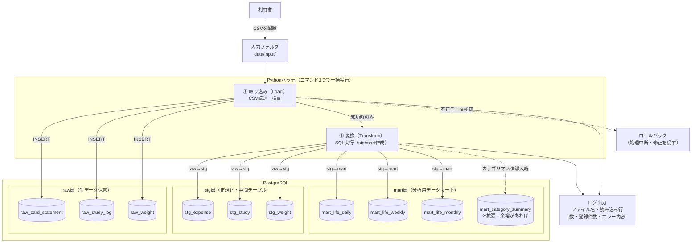
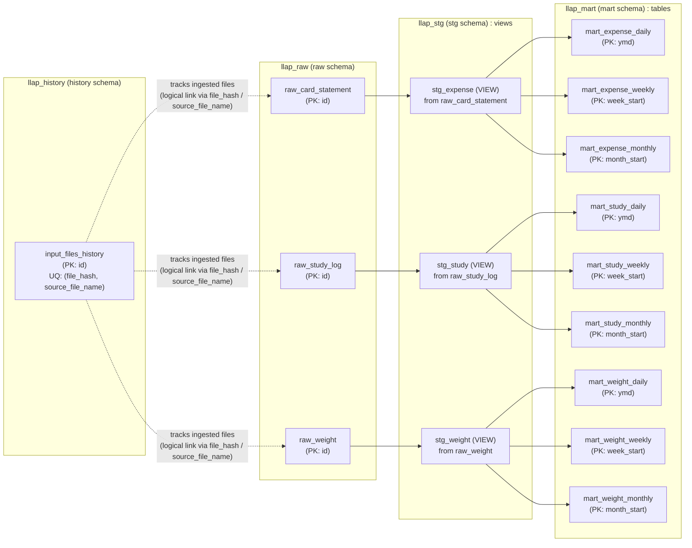
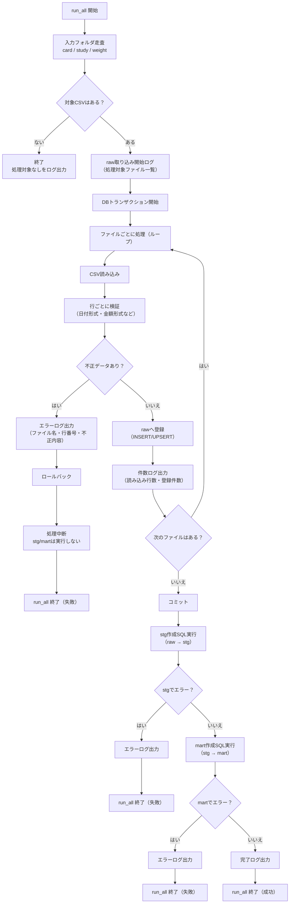

## リポジトリ構成
```graphql
lifelog-analytics-platform/
├ README.md
├ design.md
├ diagrams.md
├ docker-compose.yml
├ .env.example
├ .gitignore
│
├ scripts/
│  ├ run_all.py
│  ├ load_raw.py
│  └ run_sql.py
│
├ sql/
│  ├ 00_core_tables.sql
│  ├ 10_stg.sql
│  └ 20_mart.sql
│
└ data/
   ├ input/
   │  ├ card/      # クレカCSVを置く
   │  ├ study/     # 学習CSVを置く
   │  └ weight/    # 体重CSVを置く
   └ output/       # （任意）集計結果をCSVで出したい時用
```

---

## 2.1 アーキテクチャ設計
### 全体処理フロー


### 依存関係図


---


## 2.3 バッチ設計（処理構成・実行フロー）


